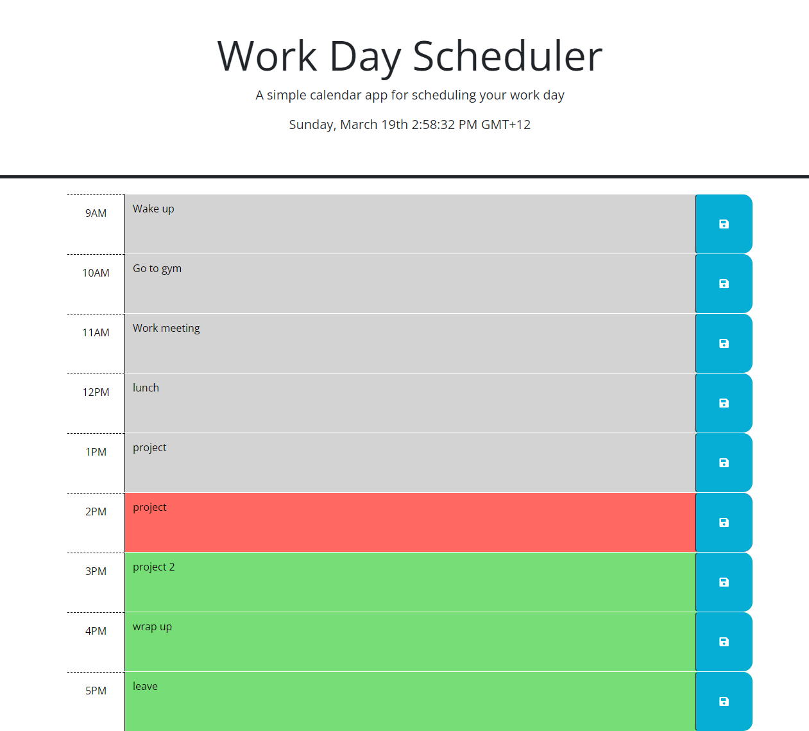

# My-Calendar

## Description
This repository is designed to showcase the ability to manipulate a preset HTML, CSS, and Javascript file with third party API's such as Dayjs and Jquery to make an operational calendar that saves your timeblocks into storage and keeps them on the page, while the colors of the blocks change according to the time zone set. There is also a clock implemented that indicates what time zone is being presented at that moment in the header.

## Installation
* Most recent version of VS code
* certain extensions such as Day.js and Jquery

## Usage

User can test their knowledge of Javascript, Jquery, and Day.js using this site, or can inspect the code and view how everything comes together. Users can also modify lines 38 and 94 in the tz() portion of the code to test out how different time zones affect the color coding of the calendar.

## Credits

* Rbustan0 (Roye Bustan)
* UCLA Web Development Bootcamp

## License

* MIT license

## Deployment

[Link to Deployed Webpage](https://rbustan0.github.io/My-Calendar/)  

[Link to Github User](https://github.com/Rbustan0)   

## Screenshots

### Note: Time zone was set to Pacific/Fiji to showcase the colors.   

